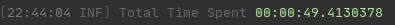
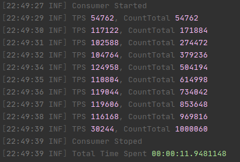
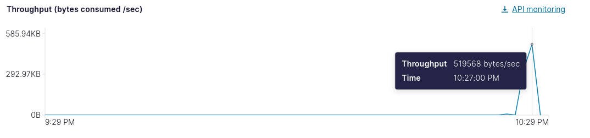

## How to run ?
First you need open `Program.cs` class and enter your broker configurations, after this
just execute `dotnet run` in root folder.

## Performance Test
To test this library https://github.com/rlanhellas/Lanhellas.KafkaConsumerBatch performance we created a Confluent.Cloud (https://confluent.cloud/) basic cluster and produced 1 million records in a topic with only 1 partition. 

The message value is simple a UUID, like this: 23d5f85e-af67-4697-9177-62d19246d6db (about 36 bytes). The producer performance don't matter to this test. 

##### Consumer Machine Configurations
All consumer tests ran in a Fedora 34, 8GB memory, Intel(R) Core(TM) i5-7200U CPU @ 2.50GHz. 

##### [1] Performance Test Batch Size 500

Here we have approximately 49 seconds to consume 1million records, with a BatchSize 500.

##### [2] Performance Test 'Unbounded Batch Size' to Measure TPS

Approximately 11 seconds to consume 1million records, without BatchSize set and 
MaxWaitTime in 1 second. 

Look to the TPS: approximately 110K TPS (Transactions Per Seconds).

##### Throughput in Confluent.Cloud

Approximately 519Kb/sec.